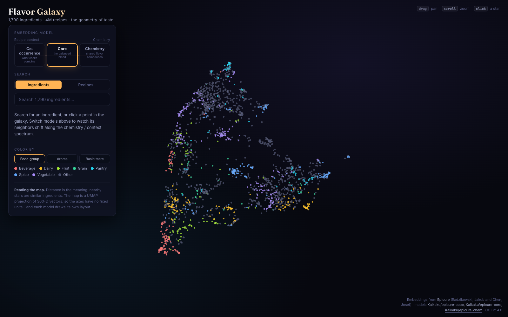
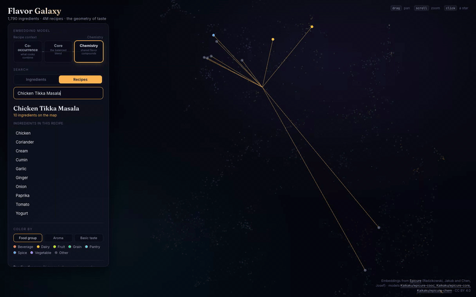
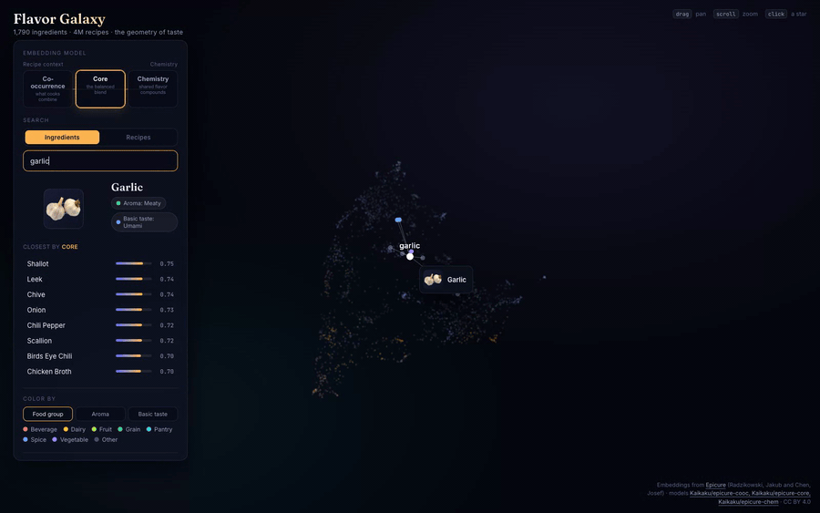
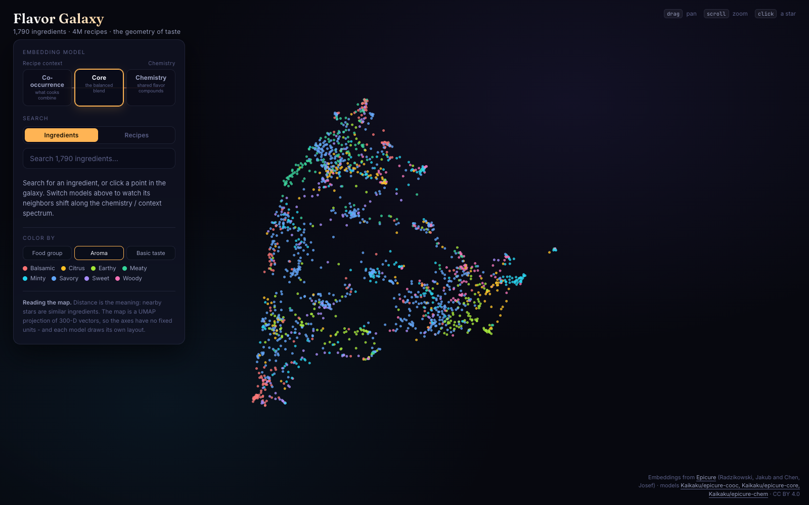

# Flavor Galaxy

An interactive map of **1,790 cooking ingredients**, learned from **4 million recipes**.
Explore how flavor is shaped by *chemistry* versus how cooks actually *combine* things.

**Live:** https://hairez.github.io/flavor-galaxy/

<p align="center">
  
</p>

It visualizes the [Epicure](https://arxiv.org/abs/2605.22391) ingredient embeddings
(Radzikowski & Chen). Epicure ships three sibling models that sit at different points on a
recipe-context to chemistry spectrum:

- **Co-occurrence** - similarity from what ingredients appear together in recipes
- **Core** - a balanced blend
- **Chemistry** - similarity from shared flavor compounds (FlavorDB)

## What you can do

- **Search any ingredient** and see its nearest neighbors (cosine similarity) under each model.
- **Switch models** and watch the whole cloud re-form - the same ingredient sits in a
  different neighborhood depending on whether you weight chemistry or culinary context.
- **Color the galaxy** by food group, aroma family, or basic taste.

<p align="center">
  
  <br>
  <sub><em>The same recipe constellation, re-forming as you slide between the chemistry and recipe-context models. Both recipe search and model switching run entirely in the browser.</em></sub>
</p>

Pick a single ingredient instead of a recipe and the same thing happens - the
whole cloud re-forms around it and its nearest neighbors shift along the
chemistry / context spectrum. This part runs entirely in your browser on the
live site:

<p align="center">
  
  <br>
  <sub><em>Garlic stays put while the cloud re-forms beneath it; its neighbor list in the panel re-ranks per model.</em></sub>
</p>

<p align="center">
  
  <br>
  <sub><em>Recolor the galaxy by food group, aroma family, or basic taste.</em></sub>
</p>

### Reading the map

Positions come from a 2-D [UMAP](https://umap-learn.readthedocs.io/) projection of the
300-dimensional embeddings. **Distance is the meaning** - nearby points are similar
ingredients - but the axes themselves carry no fixed units, and each model has its own layout.

## How it works

Everything runs in the browser, with no backend:

1. `scripts/prep-data.mjs` (run once, output committed) downloads the three models from
   Hugging Face, parses the `safetensors` embeddings, L2-normalizes them, derives categorical
   labels from the models' "mode" poles, and precomputes a UMAP layout per model. It writes
   two assets to `public/data/`: `vectors.bin` (the normalized vectors) and `meta.json`
   (names, layouts, labels, legends).
2. The app loads those assets and computes nearest neighbors live as dot products on the
   normalized vectors. The galaxy is rendered with [deck.gl](https://deck.gl/).
3. Recipe search is also fully client-side. `scripts/build-recipe-index.mjs` (run once,
   output committed under `public/data/recipe-index/`) turns the recipe corpus into a small
   prebuilt search index - a manifest plus binary postings shards keyed by search term and
   a doc-store sharded by id. The browser fetches only the shards a query touches and ranks
   results locally, so search needs no server or external API.

Food group is a weak signal in this data (there is no meat/seafood category), so ingredients
whose top two groups are too close are shown as a neutral grey **"Other"** rather than given a
misleading label.

## Develop

```bash
npm install
npm run dev          # local dev server
npm run build        # type-check + production build to dist/
npm test             # mapper + recipe-index unit tests
npm run prep         # regenerate embedding assets from Hugging Face (rarely needed)
npm run prep:index   # rebuild the recipe search index from server/data/recipes.ndjson
```

The recipe corpus that feeds `prep:index` is built separately under `server/`
(`cd server && npm run seed` for the bundled seed recipes). There is no backend.

The `docs/` screenshots and GIFs are regenerated with
[`scripts/capture-screenshots.mjs`](scripts/capture-screenshots.mjs) (Playwright +
ffmpeg, installed ad hoc - see the file header); it needs no recipe backend.

Deploys to GitHub Pages automatically on push to `main` via `.github/workflows/deploy.yml`.

## Attribution & license

- **Embeddings & ingredient data:** [Epicure](https://arxiv.org/abs/2605.22391) by Jakub
  Radzikowski and Josef Chen, published on Hugging Face
  ([epicure-cooc](https://huggingface.co/Kaikaku/epicure-cooc),
  [epicure-core](https://huggingface.co/Kaikaku/epicure-core),
  [epicure-chem](https://huggingface.co/Kaikaku/epicure-chem)), licensed **CC BY 4.0**. The
  files under `public/data/` are derived from these models and remain under CC BY 4.0.
- **Application code:** MIT (see [LICENSE](LICENSE)).
